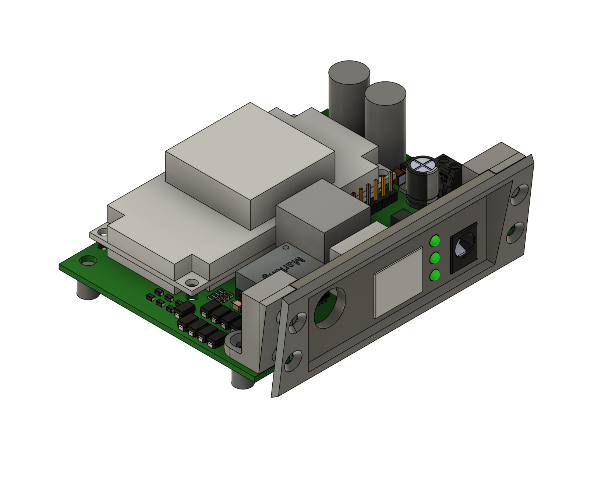
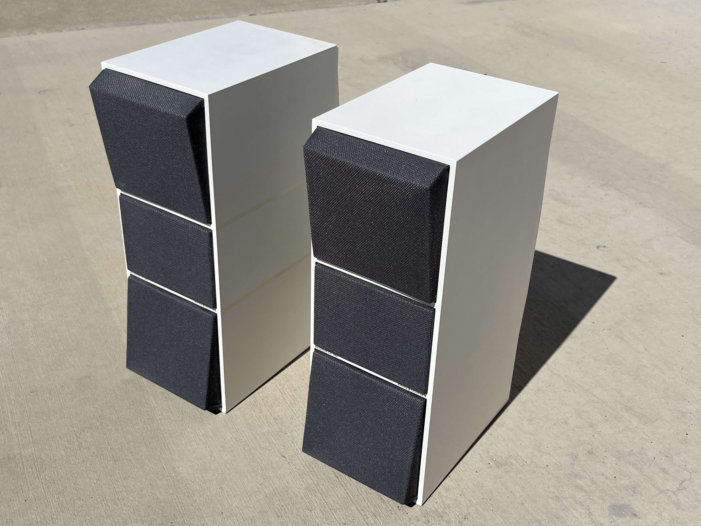
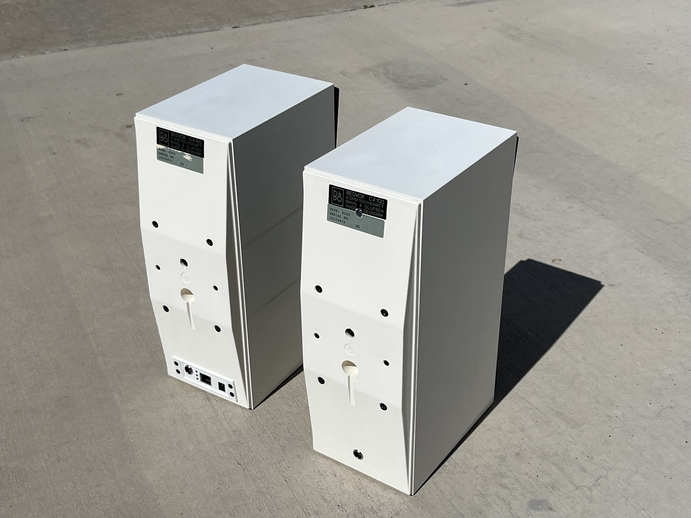
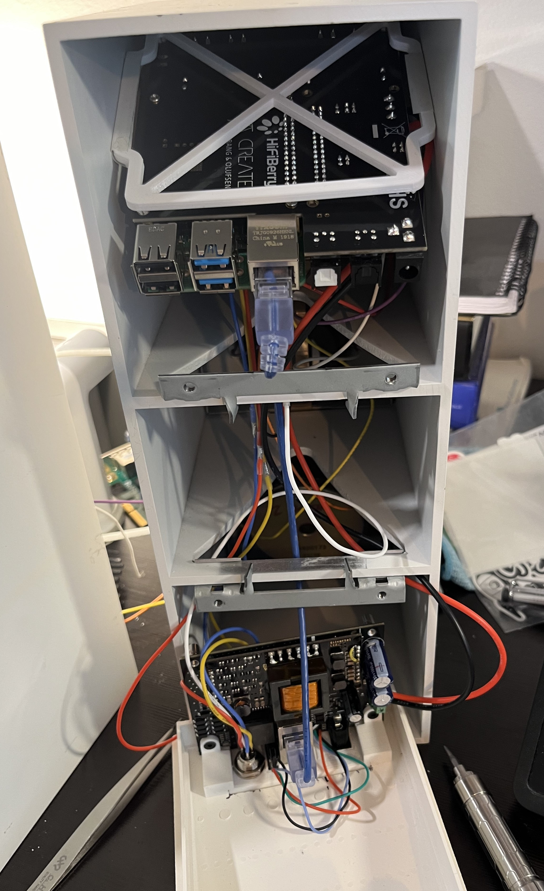
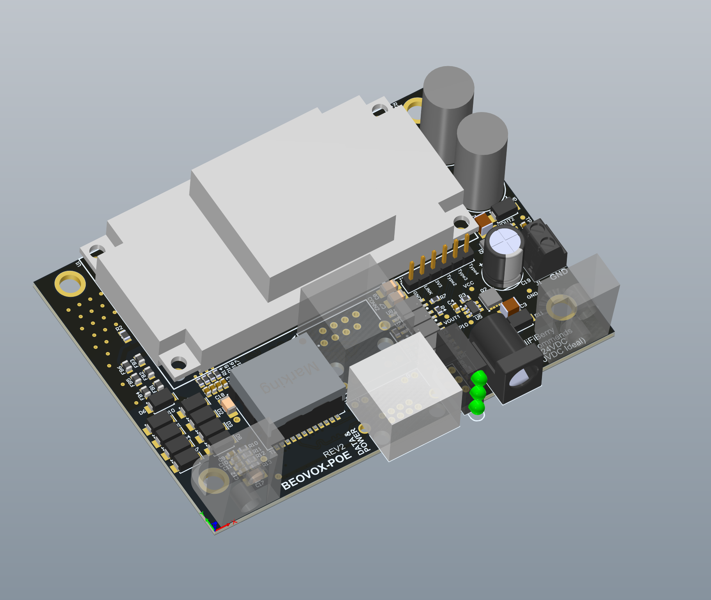

# BEOVOX-POE

BEOVOX-POE is an 80 W PoE-PD power board and panel-mount system for installing a Raspberry Pi and a [HiFiBerry Beocreate amplifier](https://www.hifiberry.com/shop/boards/beocreate-4-channel-amplifier/) inside Bang & Olufsen BeoVox CX50 or CX100 speakers.

The design takes in PoE power, passes Ethernet data through to the Pi, and gives you a single-cable install for a network-connected speaker build.

## Features

- 80 W 802.3bt / PoE++ speaker retrofit
- Ethernet passthrough for the Raspberry Pi
- Designed around the HiFiBerry Beocreate 4-channel amplifier
- Printable panel and PCB mounting hardware for CX50/CX100 cabinets

## Repository Layout

- `3d-files/`
  - STEP exports for the rear panel and PCB mounts
  - `beovox-panel-mount.f3z` if you want the Fusion archive
- `images/`
  - Build photos and renderings used in this README
- `pcb-files/`
  - `beovox-poe.PrjPcb`, `beovox-poe.SchDoc`, and `beovox-poe.PcbDoc` are the main Altium source files
  - `beovox-poe-mfg-rev2.zip` is the current manufacturing ZIP to upload to JLCPCB
  - `beovox-poe-mfg-rev1.zip` is retained as an older release
  - `Project Outputs for beovox-poe/` contains the BOM, pick-and-place, PDFs, and other exported outputs

## Photos

## Ordering the PCB

This design was prepared to be fabricated and assembled by [JLCPCB](https://jlcpcb.com/). For full output power, plan on using an IEEE 802.3bt / PoE++ source.

1. Upload `pcb-files/beovox-poe-mfg-rev2.zip`.
2. Pick the PCB color you want. Green is usually the cheapest and fastest.
3. Enable PCB assembly and choose top-side assembly.
4. Upload the BOM from `pcb-files/Project Outputs for beovox-poe/BOM/Bill of Materials-beovox-poe(assembly).csv`.
5. Upload the pick-and-place file from `pcb-files/Project Outputs for beovox-poe/Pick Place/Pick Place for beovox-poe(assembly).csv`.
6. Review placement, confirm the board orientation with JLCPCB if they ask, and place the order.

JLCPCB does not stock the PoE module or Ethernet transformer used here, so those parts need to be sourced separately and hand-soldered.

### Parts to Hand-Solder

- [Silvertel AG5800](https://www.digikey.com/en/products/detail/silvertel/AG5800/21187212)
- [Wurth Elektronik 7490220122](https://www.digikey.com/en/products/detail/w%C3%BCrth-elektronik/7490220122/6236330)
- [YIYUAN SMTSOM380BTR](https://www.lcsc.com/product-detail/SMD-round-nut_YIYUAN-SMTSOM380BTR_C5301772.html) or [Keystone 24885](https://www.digikey.com/en/products/detail/keystone-electronics/24885/9921825)

## Other Required Parts

- A pair of BeoVox CX50 or CX100 speakers
- [HiFiBerry Beocreate bundle](https://www.hifiberry.com/shop/bundles/beocreate-bundle/)
- M3 x 4 mm threaded inserts, 4 pcs
- M3 x 10 mm flat-head screws, 6 pcs
- CAT6 cable
- An IEEE 802.3bt / PoE++ switch or injector with enough power budget for the build
- 3D printer filament for the panel and PCB mounts

## 3D Printing and Assembly

1. Print `3d-files/beovox-panel-mount.step`, `3d-files/pcb-mount-left.step`, and `3d-files/pcb-mount-right.step`.
2. Install four M3 threaded inserts into the PCB mount parts with a soldering iron.
3. Fasten the PCB to the printed mounts with the flat-head screws.
4. Cut the rear opening in the speaker cabinet and fit the printed panel.
5. Complete the Beocreate and Raspberry Pi wiring inside the cabinet.

## HiFiBerry Setup

Follow the appropriate Beocreate guide from the Bang & Olufsen project:

- [Beocreate speaker guides](https://github.com/bang-olufsen/create/tree/master/Guides)

## Repairing the Speakers

Vintage CX-series speakers often need mechanical work before the electronics upgrade.

### Frames and Cloth

- Printable replacement frames: [Thingiverse](https://www.thingiverse.com/thing:365459)
- Black cloth option: [Joann speaker cloth](https://www.joann.com/utility-fabric-black-speaker-cloth/3514023.html)
- Gray cloth option: [Parts Express speaker grill cloth](https://www.parts-express.com/Speaker-Grill-Cloth-Gray-Yard-70-Wide-260-337?quantity=1)

### Surrounds

After trying several poor-fitting Amazon and eBay options, the best match I found for CX50/CX100 drivers was:

- [Audiofriends 4 AF 86B rubber surround](https://www.repairyourspeakers.com/en/surrounds-by-size/2-4-inch/4-af-86b-rubber-surround-for-repair-speaker/a-2640-10000068)
- [Audiofriends replacement video](https://youtu.be/A_NZoNgs02c?si=07Pem7QP0-d5mRjE)

## Notes for Future Revisions

- The diode OR-ing circuit could probably be replaced with a simpler power-source switch.
- A USB-C PD variant would be a fun follow-on design.

## License

This repository is distributed under the [MIT License](LICENSE).
