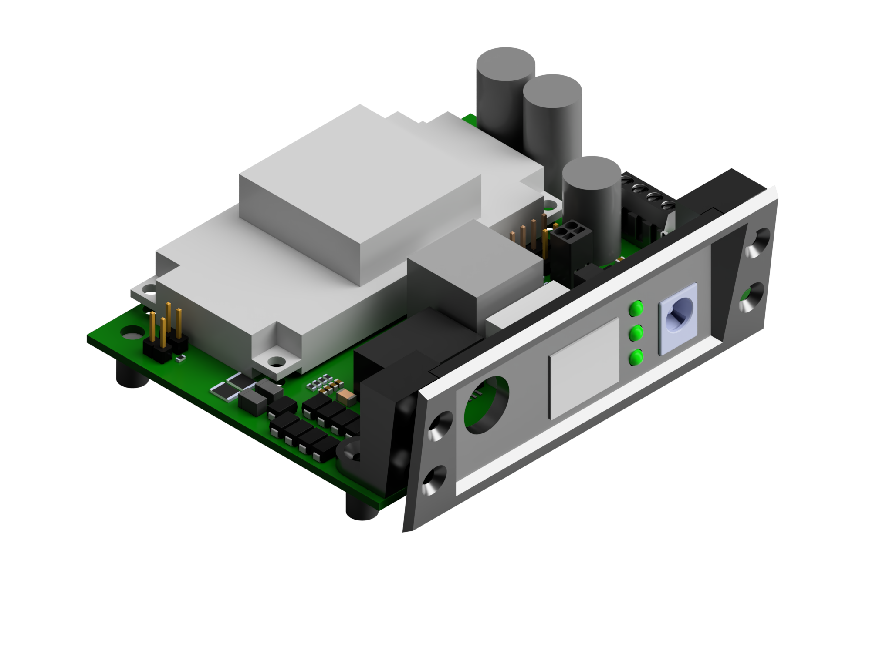
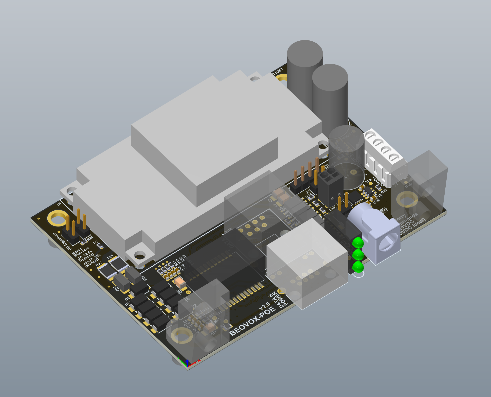
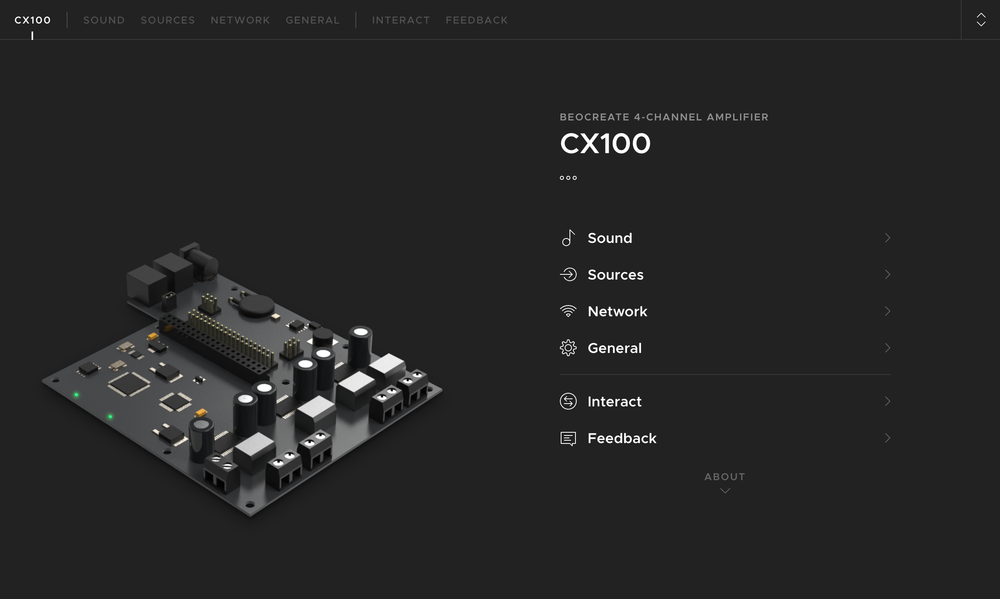

# BeoVox PoE

BeoVox PoE is an 80 W PoE-PD power board and panel-mount system for installing a Raspberry Pi and a [HiFiBerry Beocreate amplifier](https://www.hifiberry.com/shop/boards/beocreate-4-channel-amplifier/) inside Bang & Olufsen BeoVox CX50 or CX100 speakers.

The design takes in PoE power, passes Ethernet data through to the Raspberry Pi, and gives you a single-cable install for a network-connected speaker build. HiFiBerryOS supports streaming music via Bluetooth, Airplay, Spotify, Roon, and more. 
## Table of Contents

- [Features](#features)
- [Repository Layout](#repository-layout)
- [Guides](#guides)
- [Photos](#photos)
- [Parts List](#parts-list)
- [PCB](#pcb)
  - [PCB Specs and Ordering](#pcb-specs-and-ordering)
  - [PCB Setup and Notes](#pcb-setup-and-notes)
  - [Soldering](#soldering)
  - [Jumper Headers](#jumper-headers)
  - [Optional Connections](#optional-connections)
- [Panel Mount](#panel-mount)
  - [3D Printing](#3d-printing)
  - [Rear Panel Opening](#rear-panel-opening)
  - [Panel Assembly](#panel-assembly)
- [Wiring](#wiring)
  - [CX50](#cx50)
  - [CX100](#cx100)
  - [CX100 with switchable subwoofer](#cx100-with-switchable-subwoofer)
- [Software Setup](#software-setup)
- [Future Work / Ideas](#future-work--ideas)
- [License](#license)

## Features

- 80 W 802.3bt / PoE++ speaker retrofit
- Powers the HiFiBerry Beocreate 4-channel amplifier
- Multi-room audio streaming via Airplay
- Ethernet passthrough for the Raspberry Pi
- 3D-printable panel and PCB mounting hardware
- Support for BeoVox Cona Subwoofer
- PCB can be used as a general purpose PoE++ power supply 

## Repository Layout

- [3d-files/](3d-files/)
  - Main speaker retrofit CAD files, including [beovox-panel.step](3d-files/beovox-panel.step), [beovox-panel-dcled.step](3d-files/beovox-panel-dcled.step), and [beovox-pcb-mounts.step](3d-files/beovox-pcb-mounts.step)
  - [hifiberry/](3d-files/hifiberry/) contains reference HiFiBerry models and related print files, including [hifiberry-beocreate-4-1.0.2.step](3d-files/hifiberry/hifiberry-beocreate-4-1.0.2.step), [recreate-cx-4ca-cradle-v3.stl](3d-files/hifiberry/recreate-cx-4ca-cradle-v3.stl), and [recreate-cx-plug.stl](3d-files/hifiberry/recreate-cx-plug.stl)
- [guides/](guides/)
  - Supporting build documentation index in [guides/README.md](guides/README.md)
  - Auxiliary guides, including [repairing-speakers/](guides/repairing-speakers/) and [diy-mini-xlr-cable/](guides/diy-mini-xlr-cable/)
- [images/](images/)
  - Build photos, CAD renders, board renders, and wiring diagrams used throughout this README
- [pcb-files/](pcb-files/)
  - Main Altium source files: [beovox-poe.PrjPcb](pcb-files/beovox-poe.PrjPcb), [beovox-poe.SchDoc](pcb-files/beovox-poe.SchDoc), [beovox-poe.PcbDoc](pcb-files/beovox-poe.PcbDoc), [beovox-poe.OutJob](pcb-files/beovox-poe.OutJob), and [beovox-poe.IntLib](pcb-files/beovox-poe.IntLib)
  - Zipped Gerber files for PCB fabrication: [beovox-poe-v2.0-mfg.zip](pcb-files/beovox-poe-v2.0-mfg.zip)
  - Exported manufacturing outputs: [BOM/](pcb-files/BOM/), [Pick Place/](<pcb-files/Pick Place/>), [Gerber/](pcb-files/Gerber/), [NC Drill/](<pcb-files/NC Drill/>), and [ExportSTEP/](pcb-files/ExportSTEP/)
  - Reference PDFs: [beovox-poe_FabDwg.PDF](pcb-files/beovox-poe_FabDwg.PDF) and [beovox-poe_Schematic.PDF](pcb-files/beovox-poe_Schematic.PDF)
- [settings-backup.tar.gz](settings-backup.tar.gz)
  - HiFiBerryOS backup with the CX100 + Cona Subwoofer crossover, channel mapping, and output settings. Only use this if using the Subwoofer, HiFiBerryOS already includes the profiles for CX50, CX100, and others. 

## Guides

The root README focuses on the core build. Auxiliary information lives under [guides/](guides/):

- [Repairing speakers](guides/repairing-speakers/) for surrounds, replacement frames, and cloth sources
- [DIY Mini-XLR cable](guides/diy-mini-xlr-cable/) if HiFiBerry cables are unavailable

## Photos

## Video Demonstration

[Video demo on YouTube](https://youtu.be/9oT_c17GFdE)
## Parts List

| Name                                             | Description                                                                                                                      | Link                                                                                                                                                                                                                                                                        | Cost                                                           |
| ------------------------------------------------ | -------------------------------------------------------------------------------------------------------------------------------- | --------------------------------------------------------------------------------------------------------------------------------------------------------------------------------------------------------------------------------------------------------------------------- | -------------------------------------------------------------- |
| **PCB + Electronics**                            |                                                                                                                                  |                                                                                                                                                                                                                                                                             |                                                                |
| BEOVOX-POE PCB fabrication + assembly            | Fabricated PCB with top-side assembly from JLCPCB using the exported BOM and pick-and-place files.                               | https://jlcpcb.com/                                                                                                                                                                                                                                                         | You should be able to get 2-5 units assembled for around ~$100 |
| Silvertel AG5800                                 | IEEE 802.3bt 4-pair PD module; hand-soldered after PCB assembly.                                                                 | [Silvertel AG5800](https://www.digikey.com/en/products/detail/silvertel/AG5800/21187212)                                                                                                                                                                                    | $24.97                                                         |
| YIYUAN SMTSOM380BTR or Keystone 24885            | M3 threaded insert / nut option used on the board. Non-soldered standoffs or nuts can also be used.                              | [YIYUAN SMTSOM380BTR](https://www.lcsc.com/product-detail/SMD-round-nut_YIYUAN-SMTSOM380BTR_C5301772.html) [Keystone 24885](https://www.digikey.com/en/products/detail/keystone-electronics/24885/9921825)                                                               | ~$1                                                            |
| **3 pcs** 100mil jumpers                         | These are used to select the PD signature options                                                                                | [M254D-02-065-B](https://www.lcsc.com/product-detail/C2998928.html) You can find these at DigiKey, Amazon, LCSC, etc                                                                                                                                                        | $0.44                                                          |
|                                                  |                                                                                                                                  |                                                                                                                                                                                                                                                                             |                                                                |
| **Speakers + Amp**                               |                                                                                                                                  |                                                                                                                                                                                                                                                                             |                                                                |
| Pair of BeoVox CX50 or CX100 speakers            |                                                                                                                                  | I found my CX50 on eBay for $123 including shipping and CX100 for $236.                                                                                                                                                                                                     | $100-$250                                                      |
| HiFiBerry Beocreate 4 Channel Amplifier          | 4 Channel Amplifier up to 180W                                                                                                   | [HiFiBerry Beocreate 4 Channel Amplifier](https://www.hifiberry.com/shop/bundles/beocreate-bundle/)                                                                                                                                                                         | $199.00                                                        |
| Raspberry Pi 4B/1GB                              | You can use a Raspberry Pi 5 or get more RAM if you want, but its not necessary. Small adhesive heatsinks are not a bad idea.    | [Raspberry Pi 4 Model B/1GB](https://www.pishop.us/product/raspberry-pi-4-model-b-1gb/?src=raspberrypi)                                                                                                                                                                     | $35                                                            |
| Micro SD Card                                    | Class 10 at least 8GB                                                                                                            |                                                                                                                                                                                                                                                                             | ~$10                                                           |
| (Optional) BeoVox Cona Subwoofer                 |                                                                                                                                  | I bought mine used on eBay                                                                                                                                                                                                                                                  | $250-$500                                                      |
| (Optional) HiFiBerry 20V/80W Power Supply        | Only needed if you are not going to power with PoE++.                                                                            | [HiFiBerry 20V/80W Power Supply](https://www.hifiberry.com/shop/accessories/power-20v-80w/)                                                                                                                                                                                 | $32.90                                                         |
|                                                  |                                                                                                                                  |                                                                                                                                                                                                                                                                             |                                                                |
| **Other**                                        |                                                                                                                                  |                                                                                                                                                                                                                                                                             |                                                                |
| **4 pcs** M3 x 4 mm threaded inserts             | Inserts for the printed PCB mount parts.                                                                                         | [Assorted Threaded Inserts](https://a.co/d/07zoHJ45)                                                                                                                                                                                                                        | $15.98                                                         |
| **6 pcs** M3 x 10 mm flat-head screws            | Screws for fastening the PCB to the printed mounts                                                                               | [Assorted Hex Screws](https://a.co/d/05N6zpqh)                                                                                                                                                                                                                              | $12.99                                                         |
| Wire                                             | Wire for routing power and speakers internally. ~20-22AWG wire should work                                                       |                                                                                                                                                                                                                                                                             |                                                                |
| CAT6 jumper cable 1.5ft                          | Network and PoE cabling                                                                                                          | https://a.co/d/05UuwCxJ                                                                                                                                                                                                                                                     | $12.99                                                         |
| IEEE 802.3bt / PoE++ switch or injector          |                                                                                                                                  | I have this injector from LCSC [WC-PSE90B01](https://www.lcsc.com/product-detail/C2848011.html?s_z=n_wc-pse90&spm=wm.ssy.bg.0.xh&lcsc_vid=QlNcX1QCFlleAgYFTwAPUwdVRFJdA1ICT1MNBVIAEVgxVlNRQVBeVFJfQVRfUTsOAxUeFF5JWBYZEEoKFBINSQcJGk4eFQsCAgIaSgADAwAHC0slQVVdUVJRRU8GEwkK) |                                                                |
| 3D printer filament                              | Filament for the panel and PCB mount prints                                                                                      | [Overture Matte White PLA](https://a.co/d/0gjsfJBm)                                                                                                                                                                                                                         | $16.99                                                         |
| Thermal interface material                       | Use to interface AG5800 to PCB                                                                                                   |                                                                                                                                                                                                                                                                             |                                                                |
| **2 pcs** HiFiBerry Mini-XLR plug 4 pin (female) |                                                                                                                                  | [HiFiBerry Mini-XLR plug 4 pin (female)](https://www.hifiberry.com/shop/accessories/mini-xlr-plug-4-pin-female/)                                                                                                                                                            | $5.80                                                          |
| HiFiBerry Mini-XLR cable 4 pin (female/female)   | You can also make this cable yourself. See the [DIY Mini-XLR cable guide](guides/diy-mini-xlr-cable/).                           | [HiFiBerry Mini-XLR cable 4 pin (female/female)](https://www.hifiberry.com/shop/accessories/mini-xlr-cable-4-pin-female-female/)                                                                                                                                            | $14.90                                                         |
| Beovox CX50/CX100 3D parts                       | These are cheaper if you buy the amp bundle. Or you can 3D print yourself (see [3d-files/](3d-files/))                           | [Beovox CX50/CX100 3D parts](https://www.hifiberry.com/shop/beocreate/beovox-3dparts/)                                                                                                                                                                                      | $9.90                                                          |
| (Optional) (2pcs) 5mm Thermal pad                | You could use two pieces of thermal pad to interface the bottom of the PCB to the speaker cabinet for better thermal dissipation |                                                                                                                                                                                                                                                                             |                                                                |

## PCB

### PCB Specs and Ordering
This design was prepared to be fabricated and assembled by [JLCPCB](https://jlcpcb.com/). 

The PCB is available [here](https://oshwlab.com/hornej/project_ngqmoynx) on OSHWLab where you can order from JLCPCB's free EDA tool, EasyEDA. You can also find the Altium source files in the repo in [pcb-files](pcb-files). 

These are the lowest cost specs
- Stackup: JLC04161H-7628. 1oz outer copper, 1/2oz inner copper
	- I designed the Ethernet traces to 100 ohm differential for this stackup. If you want guaranteed impedance control you can select that for an extra cost.
	- It wouldn't hurt to use thicker copper but I think 1oz outer, 1/2oz inner is fine. 
- Green soldermask, White overlay
	- You can get whatever color you want, but green is the cheapest. 
- HASL
- Economy assembly (top side)
	- JLCPCB does not stock the Silvertel AG5800 module so that needs to be sourced separately and hand-soldered. The M3 standoffs on the bottom of the PCB also need to soldered, or can be swapped for non-soldered standoffs or nuts. 
### PCB Setup and Notes
For full output power you will need a IEEE 802.3bt / PoE++ source. I've also tested using a PoE+ source with success. You mileage may vary depending on how hard you are driving the speakers. 

### Soldering
- Solder the AG5800 module
- Solder the standoffs on the bottom
- Solder the 24V jumper on the bottom 
  
### Jumper Headers
- Leave J6 and J7 jumpers uninstalled
- If you are using a PoE switch for data but want to power the speakers with a DC power supply via the barrel jack then you can install a jumper on J2. When the barrel jack is present, the AG5800 POE-PD signature will be set to invalid. This will prevent the AG5800 from requesting power and will save on idle power dissipation. 
### Optional Connections
- (Optional) DC jack power LED through hole pads. You can solder an LED to these two pins to attach a panel mount LED. 
- (Optional) Raspberry Pi Link Status
	- If you want to see the Ethernet link status on the panel RJ45 jack then you need to connect to these pins on the RPi. Red is for 3.3V and Green is the LED. 
	- The PCB has a 2 pin push in terminal to attach this wires to. You will need to tin the wires before insertion into the terminal. 

  

## Panel Mount
*The current panel design only supports the CX100 speakers as the geometry of the back panel on the CX50 is slightly different. I plan to update later with a CX50 panel.*
### 3D Printing
Print `3d-files/beovox-panel.step` or `3d-files/beovox-panel-dcled.step`, plus `3d-files/beovox-pcb-mounts.step`.
### Rear Panel Opening
The safest way to make the speaker cutout is to print the panel first and use the actual printed part as the template. That accounts for cabinet variation, printer tolerance, and any cleanup you do on the finished print. 
1. Print your chosen panel file (`beovox-panel.step` or `beovox-panel-dcled.step`) before you touch the speaker cabinet. 
2. Pick the mounting location on the rear of the cabinet and make sure there is clearance inside for the RJ45 jacks, barrel jack, and PCB assembly. 
3. Put painter's tape over the cut area, mark your centerlines, and trace around the rear insertion lip of the printed panel. Do not trace the front flange; the flange is supposed to overlap the hole. 
4. Drill a starter hole near each corner, staying just inside the traced line. 
5. Connect the holes with a rotary tool, coping saw, jigsaw, or whatever small cutting tool you trust for the cabinet material. 
6. Finish with a hand file. It is easier to remove a little more material than it is to repair an oversized opening. 
### Panel Assembly
1. Fasten the printed mounts to the PCB with the flat-head screws.
## Wiring
The Amplifier fits best in the top section at a downward angle with the PoE PCB being at the bottom. 

*CX100 wiring (no sub)*

### CX50
[HiFiBerry CX50 Installation Guide](https://github.com/bang-olufsen/create/blob/master/Guides/Upcycle%20CX50%20Stereo.pdf)

### CX100
[HiFiBerry CX100 Installation Guide](https://github.com/bang-olufsen/create/blob/master/Guides/Upcycle%20CX100%20Stereo.pdf)

### CX100 with switchable subwoofer

The subwoofer wiring is a little tricky. I underestimated how many wires I would need to reroute the standard stereo wiring to the subwoofer. I used two 4PDT [switches](https://www.digikey.com/en/products/detail/nkk-switches/M2042E2S1W01/1049104). 

## Software Setup
Do this before you put it all back together!
- Download latest 64bit release of [HiFiBerryOS](https://github.com/hifiberry/hifiberry-os)
- Use [Raspberry Pi Imager](https://www.raspberrypi.com/software/) (or your preferred software) to install the OS on your microSD card
- Install the Raspberry Pi on the amplifier and power on. You can connect to a screen and keyboard/mouse but I would recommend using an Ethernet cable and set up via a browser. Once the Pi is on the network you can then set it up by going to your browser and entering its IP address. 
- Follow the guided setup to choose your speaker profile and other settings.

If you are using a BeoVox Cona Subwoofer, you can restore my [settings-backup.tar.gz](settings-backup.tar.gz), which contains the specific crossover and output settings I use. General -> System Tools -> Restore.

## Future Work / Ideas

- Simplify subwoofer wiring with external speaker crossover PCB with relays
- USB-C PD variant
- I2C temp sensor for the Pi to monitor the internal temperature
- NFC phone handoff (similar to Apple HomePod)
- Physical media controls
- External standalone enclosure to use the amplifier with other speakers
## License

This repository is distributed under the [MIT License](LICENSE).
